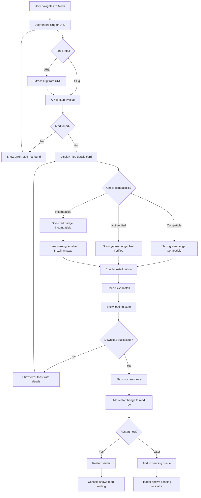
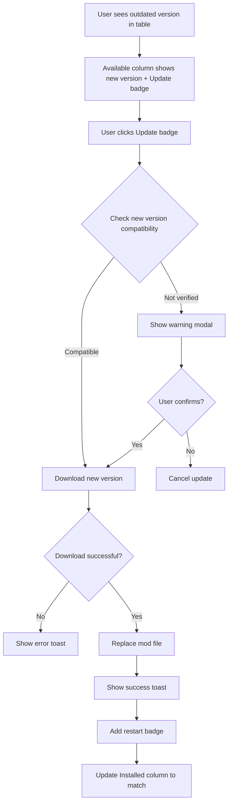
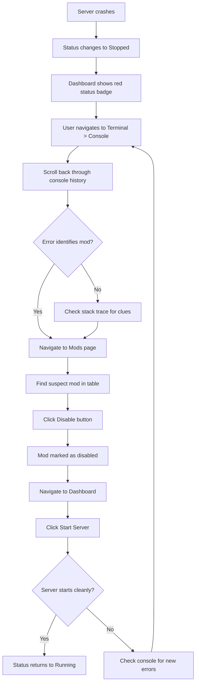
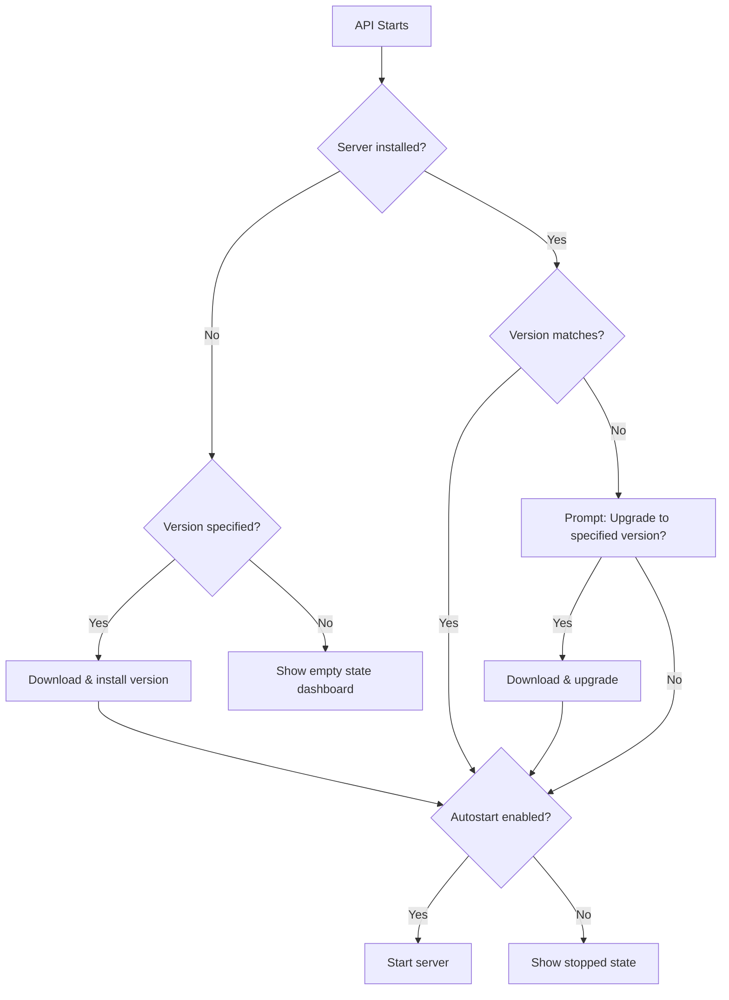

# UX Design Specification vintagestory-server

**Author:** Matt
**Date:** 2025-12-26

---

## Executive Summary

### Project Vision

VintageStory Server Manager is a self-hosted web UI that eliminates terminal access for game server administration. Built for homelab operators running containerized VintageStory servers, it provides browser-based control for server lifecycle, mod management, configuration, and real-time console access.

The core value proposition: manage your entire VintageStory server - mods, config, console - from a web UI. No SSH. No kubectl exec. No workarounds.

### Target Users

**Primary: Homelab Operators**

- Run VintageStory in Docker/Kubernetes environments
- Technically capable but convenience-seeking
- Manage servers for family/friends (personal stake in uptime)
- Access from desktop primarily, mobile for troubleshooting

**Secondary: Community Server Admins**

- May be Windows/Unraid users avoiding command lines
- Want simple self-hosting without Linux expertise
- Value approachable UI over feature density

### Key Design Challenges

1. **Information density vs. simplicity** - Console output, mod compatibility, and server status must coexist without overwhelming non-power-users

2. **Real-time state communication** - Async operations (mod installation, server restarts) need clear progress and completion states

3. **Mobile crisis mode** - Server crash troubleshooting must work on phone screens with quick access to console and controls

4. **Destructive action safety** - Appropriate friction for server stops, mod removal, and config changes without being annoying

### Design Opportunities

1. **Console-first dashboard** - Elevate the console stream as the hero element given its central role in user journeys

2. **Compatibility as differentiator** - Make mod compatibility warnings visually prominent and trustworthy

3. **Progressive disclosure** - Quick actions for common tasks, expandable detail for power users

## Core User Experience

### Defining Experience

The core experience centers on the **"slug to success" loop**: a user enters a mod slug, sees compatibility status, installs with one click, and verifies via feedback - all within seconds. This loop embodies the product's value proposition: no terminal, no file management, no uncertainty.

The console stream serves as the debugging and monitoring hub for power users, while clear status indicators and toast notifications handle verification for routine operations. Users who want depth can dive into the console; users who want efficiency get immediate visual feedback.

### Platform Strategy

| Aspect | Decision |
|--------|----------|
| **Platform** | Responsive web application |
| **Primary access** | Desktop browser with mouse/keyboard |
| **Secondary access** | Mobile browser for troubleshooting |
| **Offline support** | Not required (server management inherently requires network) |
| **Special capabilities** | None - standard web technologies |

### Effortless Interactions

The following interactions must feel completely natural and require zero thought:

1. **Mod installation** - Type slug, see compatibility, click install. No hunting for download links or managing files.

2. **Server status check** - Glance at dashboard to see running/stopped state (big, bold, unmissable), version, and uptime without any clicks.

3. **Console access** - Always one click away. Not buried in navigation, but not mandatory viewing for routine operations.

4. **Real-time feedback** - Toast notifications for success, console for detail. No refresh buttons or manual state checks.

5. **Pending restart awareness** - Persistent indicator when changes require restart, with ability to batch multiple changes before restarting.

### Critical Success Moments

| Moment | Success Criteria |
|--------|------------------|
| **First mod install** | User sees compatible status, clicks install, gets success toast, optional console verification |
| **Server crash response** | State immediately visible (RED), console history retained, error identifiable |
| **Quick restart** | Single button, visible progress, console shows startup sequence |
| **Config edit** | Validation feedback, clear save confirmation, pending restart indicator if applicable |
| **Batched changes** | Multiple config changes queued, single restart, all applied cleanly |

### Pending Restart Pattern

Many administrative actions require a server restart to take effect. The system supports two workflows:

1. **Immediate restart** - Action confirmation modal offers "Save and restart now" option
2. **Batched changes** - "Save for later" adds to pending queue; persistent header indicator shows `⟳ Restart required · N pending changes · [Restart Now]`

The API tracks `pendingRestart` state server-side, ensuring consistency across browser refreshes and multiple tabs. Users can batch config changes, mod installations, and other restart-requiring operations before executing a single restart.

### Experience Principles

1. **Status screams, console explains** - Server state dominates visually with bold, unmissable indicators. Console provides detail and debugging for those who want depth.

2. **One action, one result** - Every user action has immediate, visible feedback via toasts and state updates. No "did it work?" uncertainty.

3. **Anticipate, don't assume** - Surface the next logical action (restart prompt after mod install), but respect user intent to batch operations.

4. **Fail loudly, succeed quietly** - Errors are impossible to miss with prominent alerts. Success is calm confirmation via subtle toasts.

5. **Slug-first mod workflow** - Mod installation is as simple as typing a name. Complexity (version history, compatibility details) lives in progressive disclosure.

6. **Mobile for crisis, desktop for comfort** - Touch-first emergency controls with fat-finger-friendly buttons on mobile. Full console and detail on desktop.

## Desired Emotional Response

### Primary Emotional Goals

**Core Emotion: Relief**

VintageStory Server Manager is fundamentally a relief-oriented product. Users should feel the weight of terminal-based administration lifted. The emotional arc is: frustration eliminated, not entertainment added.

**Supporting Emotions:**

- **Confidence** - Users know exactly what the system is doing at all times
- **Control** - Users decide when actions happen; the system respects their intent
- **Trust** - Compatibility checks and warnings are reliable and explained

### Emotional Journey Mapping

| Stage | Desired Emotion | Design Implication |
|-------|-----------------|-------------------|
| **First discovery** | Skeptical curiosity → Surprised satisfaction | Clean first impression, immediate value demonstration |
| **First mod install** | "That was... it?" | Minimal steps, instant feedback |
| **Routine use** | Calm confidence | Predictable patterns, consistent behavior |
| **Error states** | Informed control | Clear error messages, actionable guidance |
| **Returning** | Comfortable familiarity | Stable UI, no relearning required |

### Micro-Emotions

**Pursue:**

- Confidence over confusion
- Trust over skepticism
- Accomplishment over frustration
- Control over helplessness

**Avoid:**

- Anxiety about server state
- Distrust of feedback accuracy
- Overwhelm from option density
- Frustration from repetitive restarts

### Design Implications

| Emotion | UX Approach |
|---------|-------------|
| **Relief** | Eliminate steps, show success immediately, make complex feel simple |
| **Confidence** | Clear labels, predictable behavior, no hidden logic |
| **Trust** | Visible compatibility checks with explanations, warnings with reasons |
| **Control** | Batching supported, no forced actions, user decides when to restart |
| **Calm** | Muted success states, reserve loud visuals for errors only |

### Emotional Design Principles

1. **Relief over delight** - This is a tool, not a toy. Efficiency and clarity trump whimsy.

2. **Calm competence** - The UI should make users feel like experts, not entertained guests.

3. **Transparent trust** - Never hide what the system is doing. Explain compatibility. Show state.

4. **Respectful control** - The user is the admin. Suggest, don't force. Batch, don't interrupt.

## UX Pattern Analysis & Inspiration

### Inspiring Products Analysis

| Product | Strengths | Transferable Patterns |
|---------|-----------|----------------------|
| **Portainer** | Status badges, row-level actions, clear hierarchy | Container/resource list pattern for mods |
| **Heimdall** | Clean dashboard, minimal clutter, focused | Essential info first, no decorative cruft |
| **TrueNAS** | Configurable data tables, technical clarity | Power-user tables with column controls |
| **QUI** | Modern shadcn/ui aesthetic, soft colors | Component library choice, visual language |
| **GitHub** | Progressive disclosure, consistent patterns | Information hierarchy, familiar interactions |

### Stated Aesthetic Preferences

- **Clean, uncluttered, modern** - Generous whitespace, limited palette
- **Light/dark mode required** - CSS variable theming, system preference detection
- **Catppuccin Mocha for dark mode** - Base #1e1e2e, text #cdd6f4, soft pastel accents
- **Catppuccin Latte for light mode** - Complementary light palette with same semantic colors
- **Soft, muted colors** - Catppuccin pastels over harsh primaries

### Transferable UX Patterns

**Navigation:**

- Sidebar navigation for main sections (Dashboard, Mods, Config, Terminal)
- Header status bar with server state and pending restart indicator

**Data Display:**

- Data tables for mod list with sorting (column customization deferred to post-MVP)
- Inline row actions (enable/disable/remove) - no modal hunting
- Status badges with soft Catppuccin colors
- Card view on mobile for table data

**Interactions:**

- Inline search/filter within views
- Toast notifications (subtle success, prominent errors)
- Modal confirmations only for destructive actions

**Visual:**

- Card-based content grouping
- Soft status colors from Catppuccin (green #a6e3a1, red #f38ba8, yellow #f9e2af)
- Clean typography with good contrast

### Terminal Component Strategy

**Component:** xterm.js - industry standard terminal emulator (used by VS Code, Hyper)

**Dual-mode terminal view:**

| Mode | Purpose | Backend |
|------|---------|---------|
| **Console** | Game server stdout/stdin streaming | WebSocket to game process pipe |
| **Shell** | Full interactive shell for advanced troubleshooting | WebSocket to PTY in game container |

**Why xterm.js:**

- WebSocket-native with `xterm-addon-attach`
- Search addon for finding errors in history
- Fit addon for responsive container sizing
- Programmatic theming maps directly to Catppuccin palette
- Battle-tested performance with large buffers

**Shell access:**

- Auth: Existing Admin API key (no separate permission)
- Context: Non-root shell in game server container
- Security: Sandboxed container, no special audit logging for MVP
- Sessions: No timeout limits for MVP

### Anti-Patterns to Avoid

| Avoid | Alternative |
|-------|-------------|
| Dense, overwhelming dashboards | Focused views, progressive disclosure |
| Bright saturated status colors | Soft Catppuccin pastels |
| Actions hidden in dropdown menus | Inline action buttons |
| Modal-heavy workflows | Inline editing, slide panels |
| Fixed table columns (post-MVP) | User-configurable column display |

### Design Inspiration Strategy

**Adopt:**

- shadcn/ui component library (React, Radix primitives, Tailwind-native)
- Catppuccin Mocha/Latte theme pairing
- xterm.js for console and shell
- Vite + React build tooling

**Adapt:**

- Portainer resource list → Mod list with compatibility badges
- GitHub clean typography → Console and config editing
- TrueNAS table controls → Sorting for MVP, column visibility post-MVP

**Avoid:**

- Heavy modals for routine actions
- Saturated traffic-light status colors
- Feature-dense dashboards requiring scroll to find status
- Next.js complexity (Vite SPA is sufficient)

## Design System Foundation

### Design System Choice

**Primary:** shadcn/ui component library
**Styling:** Tailwind CSS (encapsulated within components)
**Framework:** React with Vite build tooling
**Runtime:** Bun (for faster installs, dev server, and TypeScript execution)

### Rationale for Selection

1. **Matches aesthetic inspiration** - shadcn/ui powers QUI, the reference product for our visual language
2. **Ownership model** - Copy-paste components mean full customization control, no dependency lock-in
3. **Accessibility built-in** - Radix UI primitives provide keyboard navigation and screen reader support
4. **Theming flexibility** - CSS variable architecture maps directly to Catppuccin palettes
5. **Community and documentation** - Large ecosystem, well-maintained, extensive examples
6. **Bun compatibility** - Full support for Vite toolchain, faster development experience

### Implementation Approach

| Phase | Action |
|-------|--------|
| **Setup** | `bun create vite` with React + TypeScript template |
| **Styling** | Tailwind CSS with shadcn/ui CLI configuration |
| **Theming** | Catppuccin Mocha/Latte CSS variable layer |
| **Components** | Add shadcn components as needed (Button, Card, Table, Dialog, Toast, Tabs) |
| **Terminal** | xterm.js integration with Catppuccin theme object |

### Customization Strategy

**Color System:**

- Replace shadcn default palette with Catppuccin tokens
- Dark mode: Mocha palette (base #1e1e2e, text #cdd6f4)
- Light mode: Latte palette (complementary values)
- Semantic colors: green (#a6e3a1), red (#f38ba8), yellow (#f9e2af), blue (#89b4fa)

**Typography:**

- UI text: System font stack for performance
- Terminal/code: JetBrains Mono or similar monospace
- Consistent sizing scale from Tailwind defaults

**Component Extensions:**

- Status badges with Catppuccin accent colors
- Toast notifications matching "fail loudly, succeed quietly" principle
- Data table with TanStack Table integration for sorting

**Theme Switching:**

- CSS variable swap for instant theme changes
- `prefers-color-scheme` media query for system preference detection
- Manual toggle stored in localStorage

## Defining Core Experience

### The Defining Interaction

**"Type a mod name or paste a URL, see if it's compatible, install with one click."**

This is the "slug to success" loop - the core interaction users will describe to friends. It embodies the product's promise: no terminal, no file hunting, no version confusion.

### Flexible Input Handling

Users can provide mod identifiers in multiple formats:

| User Input | System Parses | Result |
|------------|---------------|--------|
| `smithingplus` | Slug directly | Lookup mod |
| `https://mods.vintagestory.at/smithingplus` | Extract slug from URL | Lookup mod |
| `mods.vintagestory.at/smithingplus` | Extract slug (no protocol) | Lookup mod |

**Placeholder text:** "Enter mod slug or paste URL"

This meets users where they are - browsing the mod site can copy URL directly, power users can type slugs.

### User Mental Model

**Current workflow (8 steps):**

1. Search mod website → 2. Check version compatibility manually → 3. Download zip → 4. SSH into container → 5. Navigate to folder → 6. Upload file → 7. Restart server → 8. Check logs

**Expected workflow (3 steps):**

1. Type mod name or paste URL → 2. See compatibility → 3. Click install

**User expectations:**

- "It should be like an app store"
- Compatibility should be automatic
- One action, not eight steps

**Frustration points to eliminate:**

- Manual version number comparison
- Buried download links
- No feedback on success/failure

### Success Criteria

| Criteria | Measure |
|----------|---------|
| **Speed** | Mod installed in under 10 seconds |
| **Clarity** | Compatibility status visible *before* install |
| **Confidence** | User knows install succeeded without checking console |
| **Recovery** | Clear, actionable error messages |

### Pattern Analysis

**Established patterns adopted:**

- Package manager UX (npm, pip): Install by name, version resolution automatic
- App store UX: Search → Details → Install → Done
- Container registry UX: Compatibility tags visible upfront

**Unique innovation:**

- Proactive compatibility warnings before install, not after failure
- Restart awareness with immediate/batched options
- Flexible input accepting both slugs and full URLs

### Experience Mechanics

**Stage 1: Initiation**

- "Add Mod" button or keyboard shortcut
- Input field with focus, placeholder "Enter mod slug or paste URL"
- Smart parsing extracts slug from any input format

**Stage 2: Interaction**

- Type slug or paste URL → debounced API lookup
- Mod details appear: name, description, compatibility badge
- Compatibility states: ✓ Compatible (green) | ⚠️ Not verified (yellow) | ✗ Incompatible (red)

**Stage 3: Feedback**

- Install button with loading state
- Progress indicator during download
- Success toast on completion
- Mod appears in list with restart badge

**Stage 4: Completion**

- Prompt: "Restart now to activate?" with Yes/Later options
- Later → adds to pending queue
- Yes → server restarts, console shows mod loading

## Visual Design Foundation

### Color System

**Architecture:** JSON-based theme configuration files for future extensibility (no theme selector UI for MVP).

```
themes/
  mocha.json     ← Catppuccin Mocha (dark)
  latte.json     ← Catppuccin Latte (light)
```

**Theme Toggle:** Light / Dark / System (three options only)

**Dark Mode (Catppuccin Mocha):**

| Role | Hex | Usage |
|------|-----|-------|
| Base | `#1e1e2e` | Primary background |
| Surface | `#313244` | Cards, elevated surfaces |
| Overlay | `#45475a` | Dropdowns, modals |
| Text | `#cdd6f4` | Primary text |
| Subtext | `#a6adc8` | Secondary text, labels |

**Semantic Colors:**

| Role | Mocha Hex | Usage |
|------|-----------|-------|
| Success | `#a6e3a1` | Compatible status, success toasts (subtle treatment) |
| Error | `#f38ba8` | Server stopped, errors, incompatible (prominent treatment) |
| Warning | `#f9e2af` | Not verified, pending restart, transitional states |
| Info | `#89b4fa` | Informational badges, links |
| Accent | `#cba6f7` | Primary actions, focus states |

**Color Intensity Principle:** Success = subtle (background tint), Error = prominent (border + icon emphasis). Aligns with "fail loudly, succeed quietly."

**Light Mode (Catppuccin Latte):** Complementary values from Latte palette with same semantic mappings.

### Server State Indicators

| State | Color | Icon | Description |
|-------|-------|------|-------------|
| Running | Green (`#a6e3a1`) | ● (filled) | Server is operational |
| Stopped | Red (`#f38ba8`) | ■ (square) | Server is not running |
| Starting/Stopping | Yellow (`#f9e2af`) | ◐ (animated) | Transitional state |
| Unknown | Gray (`#6c7086`) | ○ (empty) | Connection lost or state unknown |

### Typography System

**Font Stack:**

- UI: `-apple-system, BlinkMacSystemFont, "Segoe UI", Roboto, sans-serif`
- Terminal/Code: `"JetBrains Mono", "Fira Code", Consolas, monospace`

**Type Scale (Tailwind):**

- `text-2xl` (24px): Dashboard server status
- `text-xl` (20px): Page headers
- `text-lg` (18px): Section headers
- `text-base` (16px): Body text, primary UI
- `text-sm` (14px): Labels, secondary UI
- `text-xs` (12px): Timestamps, metadata

### Spacing & Layout Foundation

**Base Unit:** 4px (Tailwind default scale)

**Layout Structure:**

- Collapsible sidebar navigation (240px expanded, 64px collapsed)
- Sidebar state persisted in localStorage
- Fixed header with server name + status (e.g., "VintageStory Dev Server • Running")
- Header height: 48px
- Main content area with responsive padding

**Spacing Scale:**

- Component padding: 16px (`p-4`)
- Section padding: 24px (`p-6`)
- Inter-element gap: 8px (`gap-2`) to 16px (`gap-4`)
- Touch targets: Minimum 44px for mobile

**Layout Principles:**

1. Status bar always visible (fixed header with server name)
2. Generous whitespace for calm aesthetic
3. Consistent card treatment across views
4. Responsive breakpoints at Tailwind defaults
5. Sidebar auto-collapses on mobile breakpoints

### Accessibility Considerations

- **Contrast:** Catppuccin palettes meet WCAG AA standards
- **Focus:** Visible focus rings via Radix UI primitives
- **Keyboard:** Full navigation support from shadcn/ui components
- **Icons:** Status indicators include icons + color (not color-only)
- **Sizing:** rem-based typography respects user preferences

## Design Direction Decision

### Design Directions Explored

Through collaborative discovery, we explored visual approaches balancing:

- Information density vs. visual breathing room
- Dashboard-first vs. task-first navigation
- Prominent console vs. status-focused layouts
- Table-heavy vs. card-based mod displays
- Version visibility patterns for mod updates

### Chosen Direction

**Clean Administrative Dashboard** - A QUI/shadcn-inspired interface with:

- Persistent sidebar navigation (Dashboard, Mods, Config, Terminal)
- Status-prominent dashboard with server controls
- Sortable data tables with version comparison columns (Installed/Available)
- Dual-mode terminal (Console + Shell tabs)
- Catppuccin theming via JSON configuration
- Theme toggle in header (upper right)
- GitHub link and version info in sidebar footer (lower left)

### Design Rationale

1. **Familiar patterns** - Mirrors tools like Portainer and TrueNAS that the target user already knows
2. **Information density** - Admins need data visibility, not decorative elements
3. **Version awareness** - Installed vs Available columns surface update needs immediately
4. **Operational confidence** - Clear server state indicators and pending restart awareness
5. **Relief-oriented** - Quiet success, loud failures via toast notifications
6. **Accessibility** - Theme toggle always visible, version info readily available

### Implementation Approach

| Component | Technology |
|-----------|------------|
| Framework | React + Vite + TypeScript |
| Runtime | Bun |
| Components | shadcn/ui (copy-paste, Radix primitives) |
| Styling | Tailwind CSS with CSS variable theming |
| Tables | TanStack Table for sortable mod lists |
| Terminal | xterm.js for console and shell emulation |
| Theming | JSON-based theme files (Catppuccin Mocha/Latte) |

### Layout Elements

**Header (fixed, 48px):**

- Left: Server name + status badge
- Center: Pending restart indicator (when applicable)
- Right: Theme toggle button (sun/moon icons)

**Sidebar (240px expanded, 64px collapsed):**

- Logo + title
- Navigation: Dashboard, Mods, Config, Terminal
- Footer: GitHub link + version info (Web/API versions)

**Mod Table Columns:**

- Mod (name + slug)
- Installed (current version)
- Available (latest version with update indicator)
- Compatibility (badge)
- Status (enabled/disabled + restart required)
- Actions (disable, remove)

## User Journey Flows

### Mod Installation Flow

**Entry Point:**

- Sidebar → Mods page → Input field with placeholder "Enter mod slug or paste URL"

**Flow Diagram:**



**Success Criteria:**

- Slug to install in under 10 seconds
- Compatibility visible before install decision
- Clear feedback at every step

### Mod Update Flow

**Entry Point:**

- Mods table → "Update" badge on Available column

**Flow Diagram:**



**Success Criteria:**

- Update discoverable at a glance (version columns)
- One-click for compatible updates
- Warning before not-verified updates

### Crash Recovery Flow

**Entry Point:**

- Dashboard status shows "Stopped" with red indicator

**Flow Diagram:**



**Success Criteria:**

- Status immediately visible on crash
- Console history retained for investigation
- Quick disable without removal
- Restart from dashboard

### Journey Patterns

**Navigation Patterns:**

- Sidebar provides single-click access to all major views
- Dashboard is home base with status overview and quick actions
- No duplicate entry points - each action has one clear path

**Feedback Patterns:**

- Toast notifications for all operations (success = subtle, error = prominent)
- Status badges update in real-time
- Console streams live output
- Pending restart indicator persists until resolved

**Decision Patterns:**

- Destructive actions require confirmation modal
- Compatibility warnings allow user override
- Batch operations supported (multiple changes, single restart)

**Recovery Patterns:**

- Console history retained across crashes
- Mod disable is separate from remove (safer recovery)
- Server state visible before any action

### Flow Optimization Principles

1. **Minimize clicks to value** - Mod install is 3 steps: navigate → type → install
2. **One path per action** - No redundant entry points cluttering the UI
3. **Fail fast, recover easy** - Clear errors, disable without delete, console history
4. **Respect user intent** - Batch changes allowed, no forced restarts
5. **Progressive disclosure** - Quick actions visible, details on expansion

## Server Lifecycle Management

### Architecture Overview

The API server manages the VintageStory server binary at runtime - no server code is baked into the container image. This enables flexible version management and clean separation of concerns.

**Key Principles:**

- Server tarball downloaded and installed at runtime
- API can run without a configured server (empty state valid)
- Version can be specified via environment variable
- API reconciles actual state to desired state on startup

### Configuration

| Environment Variable | Purpose | Example |
|---------------------|---------|---------|
| `VS_SERVER_VERSION` | Desired server version | `1.21.3` |
| `VS_AUTOSTART` | Start server on API init | `true` / `false` |
| `VS_DATA_PATH` | Server files location | `/data/vintagestory` |

### Server States

| State | Description | Dashboard Display |
|-------|-------------|-------------------|
| Not Installed | No server binary present | "No server installed" + Install button |
| Installing | Download/extraction in progress | Progress bar with percentage |
| Installed (Stopped) | Server present but not running | Version badge + Start button |
| Installed (Running) | Server operational | Green status + Stop/Restart buttons |
| Upgrading | Version change in progress | Progress bar + "Upgrading to X.Y.Z" |
| Error | Installation/upgrade failed | Error message + Retry button |

### Version Management Flow



### UI Requirements

**Dashboard - No Server State:**

- Large centered message: "No VintageStory server installed"
- Version input or dropdown for available versions
- "Install Server" primary button
- Progress indicator during installation

**Dashboard - Version Mismatch:**

- Current version displayed
- Alert: "Configured version X.Y.Z differs from installed Y.Z.A"
- "Upgrade Now" / "Keep Current" options

**Config Page - Server Section:**

- Current installed version (read-only when running)
- Target version input/selector
- "Check for Updates" to query available versions
- "Change Version" button (requires server stop)
- "Delete Server" with confirmation (destructive)

**Header Updates:**

- Server name shows version: "VintageStory Dev Server v1.21.3"
- Status badge reflects installation state, not just running state

### Installation Progress UX

**Progress Indicators:**

1. Downloading tarball: "Downloading VintageStory 1.21.3... 45%"
2. Extracting: "Extracting server files..."
3. Verifying: "Verifying installation..."
4. Complete: Toast "Server 1.21.3 installed successfully"

**Error Handling:**

- Download failed: Show error + Retry button
- Extraction failed: Show error + disk space warning if applicable
- Version not found: "Version X.Y.Z not available" + link to version list

## Component Strategy

### Design System Components

**Base Library:** shadcn/ui with Radix UI primitives

| Component | Usage |
|-----------|-------|
| Button | Server controls, Install, form actions |
| Card | Dashboard stats, mod details, server install card |
| Table | Mod list with TanStack Table integration |
| Dialog | Confirmations (stop server, remove mod, delete server) |
| Toast | Operation feedback (success subtle, error prominent) |
| Tabs | Terminal Console/Shell, Config sections |
| Input | Mod slug/URL, version input, config fields |
| Badge | Base for status and compatibility badges |
| Switch | Mod enable/disable toggle |
| Skeleton | Loading states for async data |
| Progress | Server download/install progress |
| Alert | Version mismatch warnings, errors |
| Select | Version dropdown (if listing available versions) |

### Custom Components

**ServerStatusBadge**

- Purpose: Display server operational state
- States: Not Installed (gray), Installing (yellow animated), Running (green), Stopped (red), Starting/Stopping (yellow), Unknown (gray)
- Implementation: Extends Badge with state-based styling and icons

**CompatibilityBadge**

- Purpose: Show mod compatibility with server version
- States: Compatible (green + checkmark), Not verified (yellow + warning), Incompatible (red + X)
- Implementation: Extends Badge with semantic colors and Lucide icons

**VersionCell**

- Purpose: Table cell showing installed vs available mod versions
- Anatomy: Installed version + Available version + Update badge when outdated
- Implementation: Custom table cell with conditional Update button

**PendingRestartBanner**

- Purpose: Persistent header alert when changes require restart
- Anatomy: Refresh icon + "N pending changes" + "Restart Now" button
- Implementation: Custom header component

**ModLookupInput**

- Purpose: Smart input accepting slugs or URLs with live preview
- States: Empty, Loading, Found, Not Found, Error
- Implementation: Input + debounce hook + preview Card

**TerminalView**

- Purpose: xterm.js wrapper for Console and Shell access
- Tabs: Console (stdout/stdin), Shell (PTY)
- Implementation: xterm.js with addons, Catppuccin theme

**ServerInstallCard**

- Purpose: Empty state when no server installed
- Anatomy: Icon + message + version input + Install button
- States: Empty, Installing (progress), Error (retry)
- Implementation: Card with conditional content based on install state

**InstallProgress**

- Purpose: Show server download/install progress
- Anatomy: Progress bar + stage label + percentage
- Stages: Downloading, Extracting, Verifying, Complete
- Implementation: Progress component with stage text

**VersionMismatchAlert**

- Purpose: Warn when installed version differs from configured
- Anatomy: Warning icon + message + Upgrade/Keep buttons
- Implementation: Alert variant with action buttons

### Component Implementation Strategy

**Token Consistency:**

- All custom components use Catppuccin CSS variables
- Semantic colors map to component states
- Typography follows Tailwind scale

**Composition Pattern:**

- Custom components built from shadcn/ui primitives
- Badge base extended for status variants
- Card used for install and preview panels
- Progress used for download/install tracking

**Accessibility Standards:**

- ARIA live regions for dynamic content
- Keyboard navigation from Radix primitives
- Focus management for modals

### Implementation Roadmap

**Phase 1 - Core MVP:**

- ServerStatusBadge (Dashboard, Header)
- ServerInstallCard (Dashboard empty state)
- InstallProgress (Server installation)
- CompatibilityBadge (Mod table, lookup)
- ModLookupInput (Mods page)
- TerminalView - Console only
- PendingRestartBanner (Header)

**Phase 2 - Full Features:**

- TerminalView - Shell tab
- VersionCell with inline update
- VersionMismatchAlert
- Console search (xterm-addon-search)

**Phase 3 - Enhancement:**

- Sortable table headers
- Version selector dropdown

## UX Consistency Patterns

### Button Hierarchy

**Primary Actions (Accent color - Mauve `#cba6f7`):**

- Install (mod or server)
- Start Server
- Save Changes
- Restart Now (from pending banner)

**Secondary Actions (Surface color `#313244`):**

- Restart Server
- Lookup (mod search)
- Cancel
- View Details

**Destructive Actions (Red outline `#f38ba8`):**

- Stop Server
- Remove Mod
- Delete Server
- Disable (soft destructive - uses switch, not button)

**Button States:**

| State | Visual Treatment |
|-------|-----------------|
| Default | Solid fill or outline per hierarchy |
| Hover | Brightness increase (1.1) |
| Active | Slight scale down (0.98) |
| Loading | Spinner replaces icon, disabled |
| Disabled | 50% opacity, cursor not-allowed |

**Icon Usage:**

- Left-aligned icons for actions (Install, Start, Stop)
- No icons for simple actions (Cancel, Save)
- Loading spinner replaces existing icon during async

### Feedback Patterns

**Toast Notifications:**

| Type | Appearance | Duration | Use Case |
|------|------------|----------|----------|
| Success | Green left border, subtle | 3 seconds | Mod installed, config saved |
| Error | Red left border + background tint, prominent | 5 seconds + manual dismiss | Download failed, server error |
| Warning | Yellow left border | 4 seconds | Compatibility warning |
| Info | Blue left border | 3 seconds | Informational messages |

**Principle:** "Fail loudly, succeed quietly" - Success toasts are subtle and auto-dismiss. Error toasts demand attention and require action.

**Real-time Status Updates:**

- Server status badge updates immediately on state change
- Mod table reflects changes without page refresh
- Console streams live output via WebSocket
- Pending restart count updates as changes accumulate

**Progress Indicators:**

- Determinate: Server download (percentage known)
- Indeterminate: Mod lookup, server starting
- Stage labels: "Downloading... Extracting... Verifying..."

### Form Patterns

**Input Fields:**

- Focus: Mauve border (`#cba6f7`)
- Error: Red border + error message below
- Disabled: Reduced opacity, not-allowed cursor

**Mod Input Behavior:**

1. User types → debounce 300ms → API lookup
2. Loading spinner appears in input
3. Success: Preview card appears below
4. Error: Inline error message

**Config Forms:**

- Immediate validation on blur
- Save button disabled until changes made
- "Unsaved changes" warning on navigation away
- Pending restart indicator if change requires restart

**Version Input:**

- Text input for specific version (e.g., "1.21.3")
- Optional: Dropdown with available versions (Phase 2)
- Validation: Format check before API call

### Navigation Patterns

**Sidebar Navigation:**

- Always visible on desktop
- Collapsible to icons only (64px)
- Collapse state persisted in localStorage
- Active item: Mauve text + surface background
- Hover: Surface background

**Header:**

- Fixed position, always visible
- Server name + status left-aligned
- Pending restart banner center (when applicable)
- Theme toggle right-aligned

**View Switching:**

- Instant transition (no page reload)
- URL updates for bookmarkability
- Scroll position reset on view change

**Mobile Navigation:**

- Sidebar collapses to hamburger menu
- Full-screen overlay when open
- Tap outside to close

### Empty & Loading States

**Empty States:**

| Context | Message | Action |
|---------|---------|--------|
| No server installed | "No VintageStory server installed" | Install Server button |
| No mods installed | "No mods installed yet" | Input field focused |
| No console output | "Console output will appear here" | None (waiting) |

**Loading States:**

- Skeleton loaders for initial data fetch
- Spinner overlays for actions (install, update)
- Progress bars for downloads
- "Connecting..." for WebSocket initialization

**Error States:**

- Clear error message
- Retry button when applicable
- Link to troubleshooting if complex

### Confirmation Patterns

**Destructive Action Confirmations:**

| Action | Confirmation Type | Message |
|--------|------------------|---------|
| Stop Server | Modal | "Stop the server? Connected players will be disconnected." |
| Remove Mod | Modal | "Remove {mod name}? This cannot be undone." |
| Delete Server | Modal + Type to confirm | "Type 'delete' to confirm server removal" |
| Disable Mod | No confirmation | Immediate toggle (easily reversible) |

**Compatibility Warnings:**

| Scenario | Treatment |
|----------|-----------|
| Not verified mod | Yellow badge, install allowed |
| Incompatible mod | Red badge, warning modal before install |
| Update to unverified | Warning modal with "Install Anyway" option |

**Warning Modal Content:**

- Clear description of risk
- "Cancel" as secondary action
- "Install Anyway" / "Continue" as primary (user's intent)

### Mobile-Specific Patterns

**Touch Targets:**

- Minimum 44px for all interactive elements
- Increased padding on buttons and table rows

**Gestures:**

- Pull to refresh on Dashboard
- Swipe to dismiss toasts

**Simplified Views:**

- Card layout for mod list (not table)
- Stacked stats instead of grid
- Full-width buttons

## Responsive Design & Accessibility

### Responsive Strategy

**Desktop-First Approach:**
VintageStory Server Manager is primarily a desktop tool. Mobile is "crisis mode" - quick checks and emergency controls, not full administration.

**Desktop (1024px+):**

- Full sidebar navigation (240px)
- Multi-column dashboard layout
- Complete data tables with all columns
- Console with generous viewport height
- Side-by-side panels where applicable

**Tablet (768px - 1023px):**

- Collapsible sidebar (default collapsed to icons)
- Reduced column count in tables (hide Available column, show Update badge inline)
- Stacked dashboard cards
- Full-width console

**Mobile (< 768px):**

- Hamburger menu replacing sidebar
- Card-based layouts instead of tables
- Single-column stack
- Prominent server controls (Start/Stop/Restart)
- Minimal console (scrollable, reduced height)

### Breakpoint Strategy

**Tailwind CSS Breakpoints (default):**

| Breakpoint | Width | Usage |
|------------|-------|-------|
| `sm` | 640px+ | Mobile landscape, minor adjustments |
| `md` | 768px+ | Tablet, sidebar collapse |
| `lg` | 1024px+ | Desktop, full layout |
| `xl` | 1280px+ | Wide desktop, additional whitespace |
| `2xl` | 1536px+ | Ultra-wide, max content width |

**Mobile-First CSS Strategy:**
Despite desktop-first design thinking, CSS uses mobile-first breakpoints:

```css
/* Base: mobile styles */
.sidebar { display: none; }

/* md: tablet */
@media (min-width: 768px) {
  .sidebar { display: flex; width: 64px; }
}

/* lg: desktop */
@media (min-width: 1024px) {
  .sidebar { width: 240px; }
}
```

**Content Width Constraints:**

- Max content width: 1280px
- Centered with auto margins on ultra-wide
- Maintains readability on large monitors

### Accessibility Strategy

**WCAG 2.1 Level AA Target:**
Industry standard for good UX and legal compliance. VintageStory Server Manager serves a technical audience but must remain accessible to users with disabilities.

**Color Contrast:**

- Text on backgrounds: Minimum 4.5:1 ratio
- Large text (18px+): Minimum 3:1 ratio
- Catppuccin palettes designed with contrast in mind
- Status colors include icons (not color-only)

**Keyboard Navigation:**

- Full keyboard navigation via Radix UI primitives
- Visible focus indicators (Mauve outline)
- Skip link to main content
- Tab order follows visual layout
- Escape closes modals and dropdowns

**Screen Reader Support:**

- Semantic HTML structure (nav, main, header, section)
- ARIA labels for icon-only buttons
- ARIA live regions for dynamic content (toasts, status changes)
- Descriptive link text (not "click here")
- Table headers properly associated with data

**Touch Accessibility:**

- Minimum 44x44px touch targets
- Adequate spacing between interactive elements
- No hover-only interactions

**Motion and Animation:**

- Respect `prefers-reduced-motion` media query
- Reduce or eliminate animations when preference set
- No auto-playing animations that can't be paused

### Testing Strategy

**Responsive Testing:**

- Browser DevTools device emulation
- Real device testing (iPhone, Android, iPad)
- Cross-browser: Chrome, Firefox, Safari, Edge

**Accessibility Testing:**

| Tool | Purpose |
|------|---------|
| axe DevTools | Automated accessibility checks |
| Lighthouse | Accessibility audit scoring |
| VoiceOver (macOS/iOS) | Screen reader testing |
| NVDA (Windows) | Screen reader testing |
| Keyboard only | Tab navigation verification |

**Manual Testing Checklist:**

- [ ] All interactive elements reachable by keyboard
- [ ] Focus visible on all focusable elements
- [ ] Screen reader announces dynamic content changes
- [ ] Color is not the only indicator of state
- [ ] Touch targets meet minimum size
- [ ] Text readable at 200% zoom

### Implementation Guidelines

**Responsive Development:**

- Use Tailwind responsive prefixes (`md:`, `lg:`)
- Prefer relative units (`rem`, `%`) over fixed pixels
- Test breakpoint transitions during development
- Use CSS Grid and Flexbox for layouts
- Avoid horizontal scrolling on mobile

**Accessibility Development:**

- Use semantic HTML elements
- Add ARIA attributes where native semantics insufficient
- Implement focus management for modals and dynamic content
- Test with keyboard after every component
- Include alt text for any images

**Component Patterns:**

```tsx
// Button with accessible loading state
<Button disabled={isLoading} aria-busy={isLoading}>
  {isLoading ? <Spinner aria-hidden /> : <Icon />}
  <span>{isLoading ? 'Installing...' : 'Install'}</span>
</Button>

// Toast with live region
<div role="status" aria-live="polite">
  {toastMessage}
</div>

// Icon button with label
<Button variant="ghost" size="icon" aria-label="Toggle theme">
  <SunIcon />
</Button>
```

**Focus Management:**

- Return focus to trigger element when modal closes
- Focus first interactive element when modal opens
- Trap focus within modal while open
- Announce route changes to screen readers
